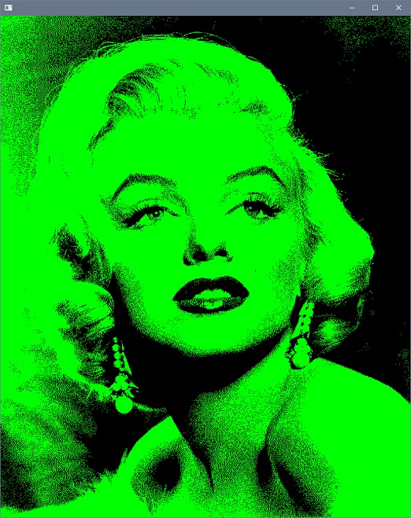
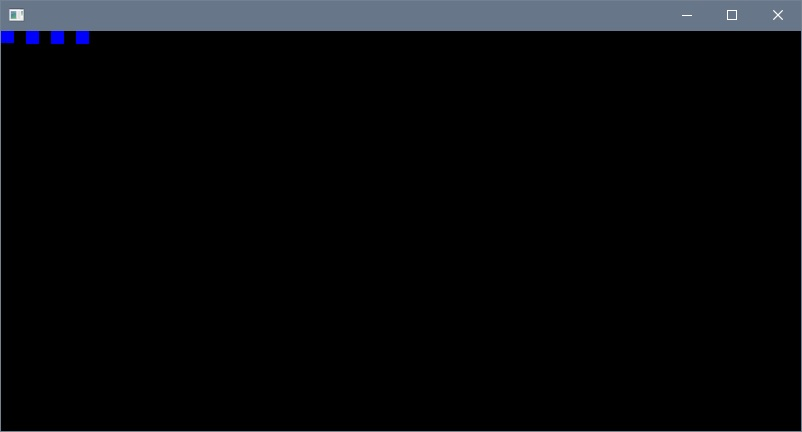

# P2501
P2501 is an emulator of Video Shifter, the most simple type of video controller.  
The goal of this project is to create a simple video interface to use in the creation of more complex emulators (ex. CHIP8).  
The emulator use modern OpenGl as render and rely on Glfw and Glew.  
This repository contains all the dependencies and all that you need to build the video device

# FUNCTIONS

### GlVideo *GlVideoInit(int width, int height)  
Initialize the video device and return a pointer to it.  
Width and Height are the current screen resolution in pixels.

### void GlVideoClose(OglVideo **video)
Close the video device and free all the internal allocated resources.  

### void GlVideolAttachMemory(OglVideo *video, byte *mem)
Attach an external memory to the video device.

### void GlVideoEnable(OglVideo *video)
Enable the video device.

### void GlVideoDisable(OglVideo *video)
Disable the video device.

### int GlVideoState(OglVideo *video)
Return 1 if the device is enabled, otherwise 0.

### void GlVideoUpdate(OglVideo *video)
Transfer the linked memory to the internal memory of the device.

### void GlVideoRender(OglVideo *video)
Render to the display the content of the video memory.

### void GlVideoSetColor(OglVideo *video, byte r, byte g, byte b)
Set the current color for the "ON" pixels of the video device.  

# EXAMPLE 1

Display an external memory of 256 bytes on a video device with resolution 64x32 setting the "ON" pixel to blue.  
The first byte of the memory is set to 0xAA (10101010).

``` 
#include "../GLVIDEO/glvideo.h"

/**********/
int main (int argc, char **argv)
{
    byte *mem = Calloc(64*32/8, sizeof(byte));
    mem[0] = 0xAA;

    GlVideo *video = GlVideoInit(64,32);

    GlVideoAttachMemory(video, mem);

    GlVideoEnable(video);

    GlVideoUpdate(video);

    GlVideoSetColor(video, 0x00, 0x00, 0xFF);

    while(GlVideoState(video)==1)
    {
        GlVideoRender(video);
    }

    GlVideoClose(&video);

    Free(mem);

    return 0;
}
``` 
Output :  


# EXAMPLE 2

Initialize an external memory with a raw ".pbm" file and display it on a video device setting the "ON" pixel to green.

``` 
#include "../GLVIDEO/glvideo.h"
#include "pbm.h"

/**********/
int main (int argc, char **argv)
{
    int w,h = 0;

    byte *mem = NULL;
    
    PbmLoad("test.pbm", &mem, &w, &h);

    GlVideo *video = GlVideoInit(w,h);

    GlVideoAttachMemory(video, mem);

    GlVideoEnable(video);

    GlVideoUpdate(video);

    GlVideoSetColor(video, 0x00, 0xFF, 0x00);

    while(GlVideoState(video)==1)
    {
        GlVideoRender(video);
    }

    GlVideoClose(&video);

    Free(mem);

    return 0;
}

``` 
Output :  

